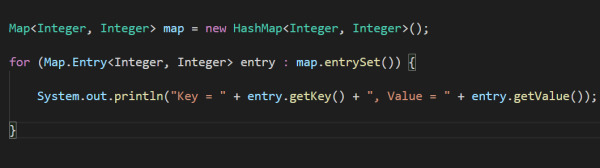
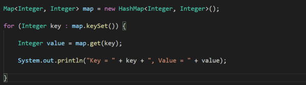
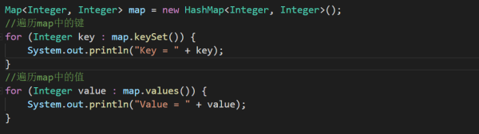
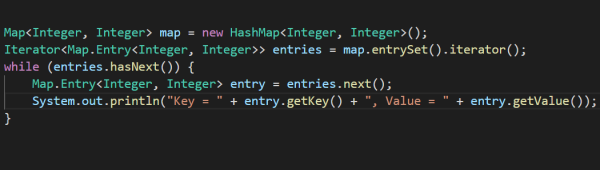
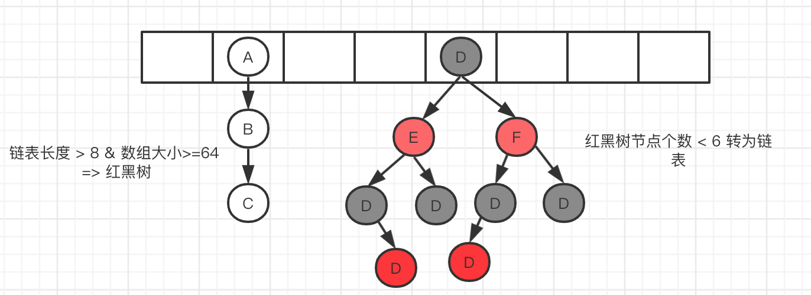
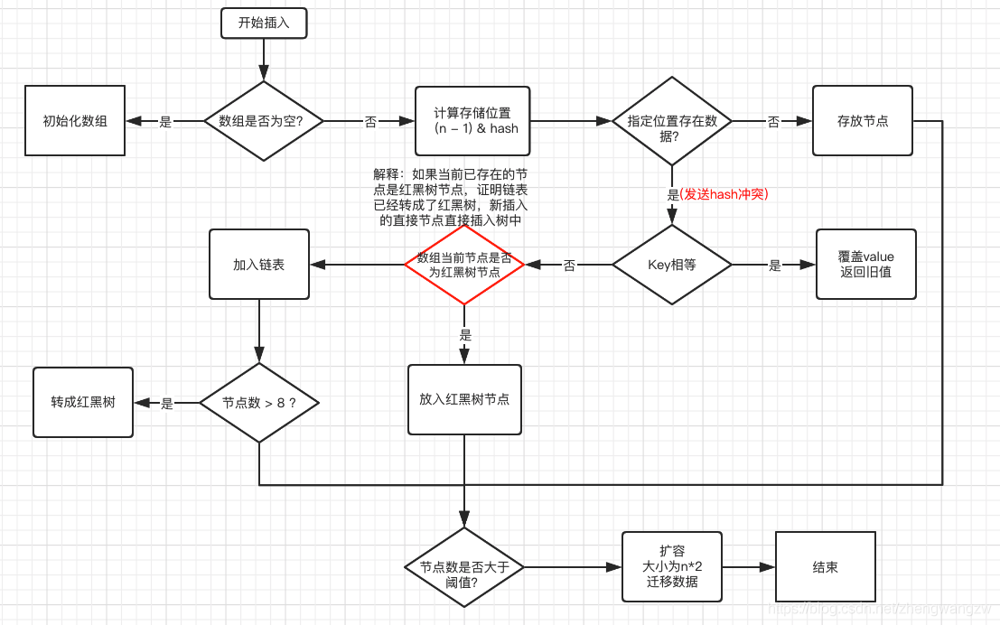

# Java笔记

## Map

[Java中遍历Map对象的4种方法：](https://zhidao.baidu.com/question/153225511.html)

> 1、通过Map.entrySet遍历key和value，在for-each循环中使用entries来遍历.推荐，尤其是容回量大时。
>
> 
>
> 2、通过Map.keySet遍历key，通过键找答值value遍历（效率低）,普遍使用，二次取值。
>
> 
>
> 3、如果只需要map中的键或者值，你可以通过Map.keySet或Map.values来实现遍历，而不是用entrySet。在for-each循环中遍历keys或values。
>
> 
>
> 4、通过Map.entrySet使用iterator遍历key和value。
>
> 
>
> 扩展资料：
>
> 关于JAVA的遍历知识补充：
>
> 1、list和set集合都实现了Iterable接口，所以他们的实现类可以使用迭代器遍历，map集合未实现该接口，若要使用迭代器循环遍历，需要借助set集合。
>
> 2、使用EntrySet 遍历，效率更高。

未完成

[Java 0:0:0:0](https://www.baidu.com/s?ie=utf-8&f=8&rsv_bp=1&tn=84053098_3_dg&wd=java%200%3A0%3A0%3A0%3A0%3A0%3A0%3A1&oq=Mac%2520java%25200%253A0%253A0%253A0%253A0%253A0%253A0%253A1&rsv_pq=f570dd040007ae76&rsv_t=78bcCPLSyVhbNsRk8Eliizxnb%2F4TVtsp9RYv1AWH0gI0yu4ixoJ8YwxyQjS%2BUF7w59sp8g&rqlang=cn&rsv_enter=1&rsv_dl=tb&inputT=252&rsv_sug3=13&rsv_sug2=0&rsv_sug4=9327&bs=Mac%20java%200%3A0%3A0%3A0%3A0%3A0%3A0%3A1&rsv_jmp=fail)未添加


[一个HashMap跟面试官扯了半个小时](https://blog.csdn.net/zhengwangzw/article/details/104889549?utm_medium=distribute.pc_category.none-task-blog-hot-10&depth_1-utm_source=distribute.pc_category.none-task-blog-hot-10&request_id=)	**安琪拉**

> HashMap的内部数据结构，JDK1.8版本的，内部使用数组 + 链表红黑树：
>
> 
>
> HashMap的数据插入原理：
>
> 
>
> 1. 判断数组是否为空，为空进行初始化;
> 2. 不为空，计算 k 的 hash 值，通过`(n - 1) & hash`计算应当存放在数组中的下标 index;
> 3. 查看 table[index] 是否存在数据，没有数据就构造一个Node节点存放在 table[index] 中；
> 4. 存在数据，说明发生了hash冲突(存在二个节点key的hash值一样), 继续判断key是否相等，相等，用新的value替换原数据(onlyIfAbsent为false)；
> 5. 如果不相等，判断当前节点类型是不是树型节点，如果是树型节点，创造树型节点插入红黑树中；(如果当前节点是树型节点证明当前已经是红黑树了)
> 6. 如果不是树型节点，创建普通Node加入链表中；判断链表长度是否大于 8并且数组长度大于64， 大于的话链表转换为红黑树；
> 7. 插入完成之后判断当前节点数是否大于阈值，如果大于开始扩容为原数组的二倍。
>
> HashMap怎么设定初始容量大小：一般如果`new HashMap()` 不传值，默认大小是16，负载因子是0.75， 如果自己传入初始大小k，初始化大小为 大于k的 2的整数次方，例如如果传10，大小为16。（补充说明:实现代码如下）
>
> ```java
> static final int tableSizeFor(int cap) {
>   int n = cap - 1;
>   n |= n >>> 1;
>   n |= n >>> 2;
>   n |= n >>> 4;
>   n |= n >>> 8;
>   n |= n >>> 16;
>   return (n < 0) ? 1 : (n >= MAXIMUM_CAPACITY) ? MAXIMUM_CAPACITY : n + 1;
> }
> ```
>
> HashMap的哈希函数：hash函数是先拿到 key 的hashcode，是一个32位的int值，然后让hashcode的高16位和低16位进行异或操作。也叫扰动函数，这么设计有二点原因：
>
> 1. 一定要尽可能降低hash碰撞，越分散越好；
> 2. 算法一定要尽可能高效，因为这是高频操作, 因此采用位运算；
>
> hashcode的高16位和低16位异或能降低hash碰撞的原因，hash函数能不能直接用key的hashcode：
>
> 

## 关键字

[final关键字：](https://blog.csdn.net/qq_34375473/article/details/81487803)

> final在Java中是一个保留的关键字，可以声明成员变量、方法、类以及本地变量。一旦你将引用声明作final，你将不能改变这个引用了，编译器会检查代码，如果你试图将变量再次初始化的话，编译器会报编译错误。

### [Java数组的三种打印方式](https://blog.csdn.net/chenkaibsw/article/details/78989459)

> **1.数组的输出的三种方式**
>
> **一维数组：**
>
> 定义一个数组  int[] array = {1,2,3,4,5};
>
> （1）传统的for循环方式
>
> ```java
> for(int i=0;i<array.length;i++)
> {
>       System.out.println(array[i]);
> }
> ```
>
> （2）for each循环
>
> ```java
> for(int a:array)
>     System.out.println(a);
> ```
>
> 3）利用Array类中的toString方法
>
> 调用Array.toString(a)，返回一个包含数组元素的字符串，这些元素被放置在括号内，并用逗号分开
>
> ```java
> int[] array = {1,2,3,4,5};
> System.out.println(Arrays.toString(array));
> ```
>
> System.out.println(array);打印是的是数组的首地址。
>
> 二维的方法相似，多维数组被解读为"数组的数组"。

## JVM

### [Java Web基础篇之浅谈JVM](https://blog.csdn.net/zangdaiyang1991/article/details/90749676)

> JVM(Java Virtual Machine)：整个java实现跨平台的最核心的部分，能够运行以Java语言写的程序。
>
> JVM是Java Virtual Machine（Java虚拟机）的缩写，JVM是一种用于计算设备的规范，它是一个虚构出来的计算机，是通过在实际的计算机上仿真模拟各种计算机功能来实现的。
>
> Java虚拟机在执行字节码时，把字节码解释成具体平台上的机器指令执行。这就是Java的能够“一次编译，到处运行”的原因。
>
> ## JVM体系结构与运行原理
>
> Java语言写的源程序通过Java编译器，编译成与平台无关的‘字节码程序’(.class文件，也就是0，1二进制程序)，然后在OS之上的Java解释器中解释执行。
>
> 